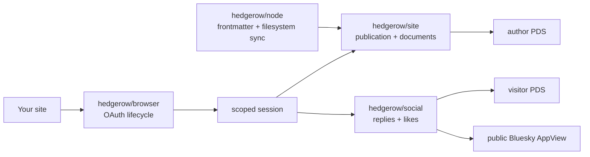

# hedgerow

The curated Hedgerow API. Publish a site into an AT Protocol repository, read
its articles back, and show the Bluesky conversation around each article on
the site itself.

```bash
npm install hedgerow
```

Use the feature subpaths in application code:

```ts
import { createBrowser } from "hedgerow/browser";
import { actor, permissionScope } from "hedgerow/social";

const auth = createBrowser({ clientId, scope: permissionScope });
const session = await auth.restore();
const social = session ? actor(session) : null;
```



## Why these subpaths

- `hedgerow/browser` owns only browser OAuth and session lifecycle. It starts
  identity-only and accepts a feature's permission scope; it does not decide
  whether the person is a reader or an author.
- `hedgerow/social` owns public thread/like reads and signed-in reply/like
  actions. Reading public conversations is anonymous; writing never is. A
  reply or like is a real Bluesky record in the visitor's own repository.
- `hedgerow/site` owns publications, documents, safe Markdown decoding and a
  publication-bound author capability. It injects publication membership and
  hides arbitrary collection/rkey writes.
- `hedgerow/node` is the Node-only Markdown/frontmatter synchronisation path.
  `parseMarkdown()` converts a file's YAML frontmatter and body into a
  `ParsedPost`; `syncMarkdown()` authenticates and reconciles those posts with
  the PDS. It lives separately so browser bundles never load filesystem,
  loopback-server or CLI dependencies.

Each feature exports `permissionScope`. Put the maximum union in hosted OAuth
client metadata, then request only the subset needed by the current flow:

```ts
import { combineScopes, createBrowser } from "hedgerow/browser";
import { permissionScope as socialScope } from "hedgerow/social";
import { permissionScope as authorScope } from "hedgerow/site";

const clientMetadataScope = combineScopes(socialScope, authorScope);
const auth = createBrowser({ clientId, scope: socialScope });
```

For a dedicated author route or subdomain, request `authorScope` instead. The
OAuth server—not TypeScript—is the security boundary; the capability wrappers
add a smaller, harder-to-misuse product API on top.

## Site authoring

```ts
import { author, readSite } from "hedgerow/site";

const published = await readSite(ownerDid, fetch, { publicationUri });
const writer = author(session, { ownerDid, publicationUri });

const created = await writer.createDocument({
  path: "/blog/hello",
  title: "Hello",
  publishedAt: new Date().toISOString(),
  markdown: "Hello **world**.",
});
```

Updates retain the same AT URI and use the loaded CID as a compare-and-swap
token. If another tab or client changed the article first, the operation
throws `RecordConflictError` instead of silently overwriting it.

## What is deliberately not here

TipTap configuration, IndexedDB draft policy, preview/diff UI, site styling,
URL layout and hosting-cache policy remain generated application code for now.
Those are product decisions, not protocol invariants. `create-hedgerow` will
provide the maintained starter; a reusable editor package should only exist
after independent sites converge on the same runtime contract.

Pre-1.0, ESM-only. [MIT](./LICENSE).
